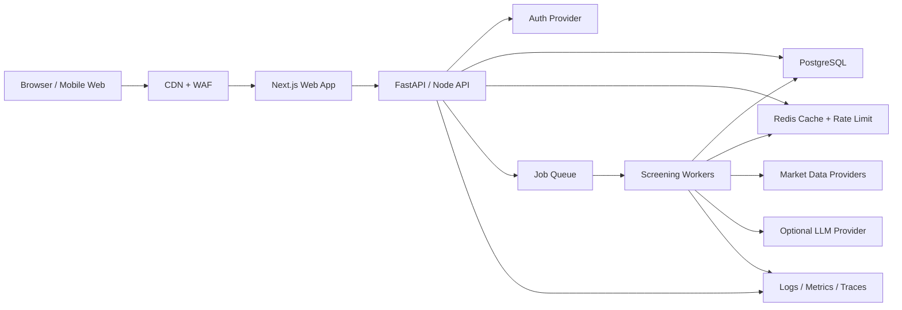

# 1000-User SaaS Architecture

Last updated: 2026-05-16

## 1. Executive Decision

The current product is a local CLI private-beta tool. A 1000-user product must be a separate SaaS application that reuses the deterministic screening/scoring domain logic but replaces local SQLite and command-line workflows with authenticated web/API, multi-tenant PostgreSQL, asynchronous jobs, provider budgeting, audit trails, and production observability.

Do not expose the existing CLI or SQLite DB as a shared service.

## 2. Target Product Definition

VCB-Alt SaaS is a web-based stock screening and decision-support platform where authenticated retail users maintain watchlists, run delayed-data screeners, view scored candidates, manage decision journals, and export/delete their data. It remains decision support only and does not place trades.

## 3. Scale Target

Initial 1000-user target:

- Registered users: 1000
- Daily active users: 200-300
- Peak concurrent active sessions: 50-100
- Watchlist size: 30-100 tickers per user
- Daily scheduled scans: up to 1000 user-watchlist scan jobs
- Shared market-data universe: 500-2000 tickers
- User-facing API p95 latency: under 500 ms for cached reads
- On-demand ticker evaluation p95 latency: under 2 seconds when cached market data exists
- Daily batch completion: under 30 minutes

## 4. Architecture Overview

## 5. Recommended Stack

### Application

- Frontend: Next.js + TypeScript
- API: FastAPI + Python or Node/TypeScript
- Domain/scoring: keep Python `vcb_alt.scoring` as the first reusable service module, then move to a versioned internal package
- Background jobs: Celery/RQ/Arq with Redis, or managed queue such as SQS
- Database: PostgreSQL, with row-level tenant scoping
- Cache/rate limit: Redis
- Object storage: S3-compatible storage for exports and large reports
- Observability: OpenTelemetry, Sentry, hosted logs, metrics dashboards

### Deployment

- Private beta: Render/Fly.io/Railway/AWS ECS is acceptable.
- 1000 users: AWS ECS/Fargate or Kubernetes only after team can operate it.
- DB: managed PostgreSQL with PITR backups.
- Redis: managed Redis.

## 6. Service Boundaries

### Web App

- Login/signup
- Watchlist UI
- Screening result UI
- Billing-free beta onboarding
- Data export/delete settings
- Admin/support dashboard for authorized staff

### API Service

- Auth verification
- Tenant/user authorization
- CRUD for watchlists, evaluations, journals, settings
- Request validation
- Rate limit enforcement
- Job enqueue
- Audit event creation

### Worker Service

- Shared market data refresh
- User watchlist scans
- Evaluation persistence
- Provider retry/backoff
- External API budget checks
- Failure events

### Domain Package

- Ticker validation
- Scoring rules
- Risk notes
- Result schemas
- No DB/session/global state

## 7. Multi-Tenant Model

Every user-owned table must include:

- `tenant_id`
- `user_id` where row ownership matters
- `created_at`
- `updated_at`

Authorization rule:

- User can only read/write rows matching their tenant membership.
- Admin actions require role checks and must be audit logged.
- Never use ticker alone as a primary key for user-owned state; use `(tenant_id, user_id, ticker)` or UUID row IDs.

## 8. Data Flow

### First Signup

1. User authenticates with email/OAuth.
2. API creates tenant, user profile, default settings, empty watchlist.
3. UI shows first-run empty state.
4. User adds tickers.
5. API validates and enqueues initial scan.

### Daily Scan

1. Scheduler enqueues batch jobs per active tenant/user.
2. Worker reads watchlist.
3. Worker reads cached market data; refreshes stale shared data within budget.
4. Worker runs scoring.
5. Worker writes evaluation rows and audit events.
6. UI reads latest cached evaluation results.

### On-Demand Evaluation

1. User submits ticker.
2. API validates ticker and rate limit.
3. If cached data is fresh, API evaluates immediately.
4. If cache is stale, API enqueues job and returns `202 Accepted`.
5. UI shows loading/pending state.

## 9. API Surface

Minimum v1 endpoints:

- `GET /healthz`
- `GET /readyz`
- `GET /v1/me`
- `GET /v1/watchlist`
- `POST /v1/watchlist`
- `DELETE /v1/watchlist/{ticker}`
- `POST /v1/evaluations`
- `GET /v1/evaluations/latest`
- `GET /v1/evaluations/{id}`
- `GET /v1/jobs/{id}`
- `GET /v1/audit-events`
- `POST /v1/exports`
- `DELETE /v1/account`
- `GET /admin/users`
- `GET /admin/jobs`
- `GET /admin/provider-status`

## 10. Non-Negotiable Security Controls

- OAuth/email auth with verified email.
- Tenant scoped authorization on every request.
- CSRF protection for cookie sessions, or token-based auth with secure storage.
- Request rate limits per user/IP/endpoint.
- Idempotency keys for mutation endpoints.
- Redacted structured logs.
- Secrets only in managed secret store.
- Account/data deletion workflow.
- Admin RBAC and immutable audit log.
- Legal disclaimer and no auto-trading.

## 11. Reliability Controls

- Queue retries with exponential backoff and dead-letter queue.
- Provider circuit breakers.
- External API request budgets per provider/day.
- Scheduled jobs must be idempotent.
- DB migrations run separately from app boot.
- Health/readiness endpoints.
- PITR backups and restore drills.
- Synthetic checks for login, add ticker, scan, results.

## 12. What Can Be Reused

- `vcb_alt.validation`: ticker and input validation patterns.
- `vcb_alt.scoring`: deterministic scoring logic after making it provider-agnostic and schema-versioned.
- `vcb_alt.models`: result envelopes and scoring result shapes, after converting to API schema models.
- `vcb_alt.security`: redaction helpers.
- Tests as seed examples for domain behavior.

## 13. What Must Be Rebuilt

- Storage: SQLite single-user schema must become PostgreSQL multi-tenant schema.
- Interface: CLI must become API + web UI.
- Operations: local logs must become centralized structured logs and metrics.
- Jobs: synchronous scan loop must become queue workers.
- Admin: local admin commands must become RBAC-protected admin UI/API.

## 14. Release Gate

The product is not ready for 1000 users until:

- Auth and tenant isolation tests pass.
- API and worker services are load tested.
- Provider budget and failure behavior are tested.
- Account deletion/export are verified.
- Security review and financial/legal review are complete.
- Observability dashboards exist and alert.

